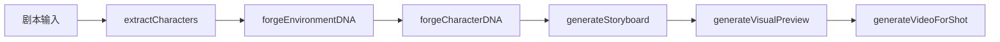

# Foundr 开发文档

## 快速开始

```bash
# 1. 安装依赖
npm install

# 2. 配置环境变量
cp .env.local.example .env.local
# 编辑 .env.local 填入 API 密钥

# 3. 启动开发服务器
npm run dev
# 访问 http://localhost:3000
```

## 项目架构

```
Foundr/
├── App.tsx              # 主应用 (状态管理、UI流程)
├── index.tsx            # React 入口
├── index.html           # HTML 模板
├── types.ts             # TypeScript 类型定义
├── vite.config.ts       # Vite 配置
├── components/
│   ├── ErrorBoundary.tsx   # 全局错误边界
│   ├── StoryboardCard.tsx  # 分镜卡片
│   └── Timeline.tsx        # 时间轴组件
└── services/
    └── geminiService.ts    # AI 服务 (核心功能)
```

## 核心流程



| 步骤 | 函数 | 说明 |
|------|------|------|
| 角色提取 | `extractCharacters()` | 从剧本识别主要角色 |
| 环境 DNA | `forgeEnvironmentDNA()` | 生成场景视觉描述 |
| 角色 DNA | `forgeCharacterDNA()` | 生成角色视觉描述 |
| 分镜脚本 | `generateStoryboard()` | 拆解为镜头列表 |
| 图片渲染 | `generateVisualPreview()` | 生成分镜预览图 |
| 视频合成 | `generateVideoForShot()` | 生成视频片段 |

## 环境变量

| 变量 | 必需 | 说明 |
|------|------|------|
| `GEMINI_API_KEY` | ✅ | Google Gemini API Key |
| `RUNNINGHUB_API_KEY` | ❌ | RunningHub API Key (可选) |

## 状态持久化

项目自动将状态保存到 `localStorage`：
- **键名**: `foundr-project-state`
- **保存时机**: 状态变化时自动保存
- **清除**: 点击"重置"按钮清除

## 常见问题

### Gemini API 限流 (429)

服务内置重试机制，会自动重试 3 次，指数退避延迟。

### RunningHub CORS 错误

RunningHub API 可能存在跨域限制，建议：
1. 使用 Gemini 引擎替代
2. 联系 RunningHub 开启 CORS

### 视频生成失败

确保已在 AI Studio 选择了 API Key 并启用视频生成权限。

## 开发命令

```bash
npm run dev      # 开发服务器 (端口 3000)
npm run build    # 生产构建
npm run preview  # 预览构建结果
npx tsc --noEmit # TypeScript 类型检查
```
